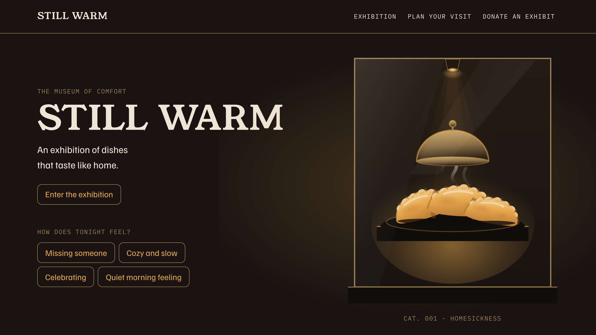

# Still Warm

**A museum where comfort food is the art.**

An exhibition of dishes that taste like home. Walk four rooms, read the labels, and leave a memory that becomes the last exhibit.

**[Visit the museum](https://still-warm.boyko-nazar.workers.dev/)**



Built for the DEV Frontend Challenge: Comfort Food Edition (Perfect Landing). Every visitor who donates a memory gets an exhibit generated from their own words, and a postcard to take home.

## Floor plan

The source is laid out the way the museum is:

```
src/
  content/         the exhibition's writing - stories, curator notes, the Ramp,
                   the donation desk, the room guide. Typed data, never inline.
  components/
    layout/        header, footer, container, section headings
    hero/          the display case, the entrance, "How does tonight feel?"
    exhibition/    the four rooms, the placards, the Spotlight Unfold, the walk
      art/         each dish, drawn in SVG in the calibrated food language
    art/           the shared varenyk, used by the hero and Room 001
    donate/        the donation desk, the reserved frame, the generated exhibit,
                   the gift shop postcard
    visit/         Plan Your Visit
    ui/            the one button
  hooks/           entrance state, in-view, scroll position, print expansion
  styles/          tokens, global, steam, print
  utils/           contrast maths, the staff entrance
```

Two rules hold the place together: content lives in `src/content/` as typed data, and the palette, type scale, spacing and timings are defined in `src/styles/tokens.css`; the hand-drawn SVG dishes carry their own literal values inline.

## Conservation notes

Accessibility is the first judging criterion, so it is built in rather than audited on:

- **Every claim on Exhibit 000 is verified.** Contrast was measured live from painted pixels across 797 text runs at two viewports - zero AA failures. The keyboard routes through every room in 23 stops. Every label is exposed to a screen reader, including the generated exhibit, whose art is decorative and whose placard carries the description.
- **Reduced motion ships with the motion**, in the same commit, for all nine animations. Body text is byte-identical between modes.
- **axe runs in CI on every state** - and incompletes have to be empty too, not just violations.
- **Five browser projects** on every pull request: Chromium, WebKit, Firefox, and mobile Chrome and Safari.
- Measured on the built site: CLS 0.00 on desktop, mobile and Fast 3G; one 70ms long task under 4x CPU throttle, none over 100ms; Lighthouse accessibility 100.

```bash
npm run verify   # format, lint, types, unit tests, build
npx playwright test   # the five-project end-to-end matrix
```

## Visiting

```bash
npm install
npm run dev      # the museum on localhost:5173
```

Print the page for an exhibition booklet, or open the console for the staff entrance.

## Credits

Type: [Young Serif](https://github.com/noirblancrouge/YoungSerif), [Familjen Grotesk](https://github.com/Familjen-Sthlm/Familjen-Grotesk), [IBM Plex Mono](https://github.com/IBM/plex) - all self-hosted under the SIL Open Font License 1.1. The licence text for each ships beside the fonts in [`public/fonts/`](public/fonts/).

Built by [Nazar Boyko](https://github.com/nazboyko). MIT licensed.
